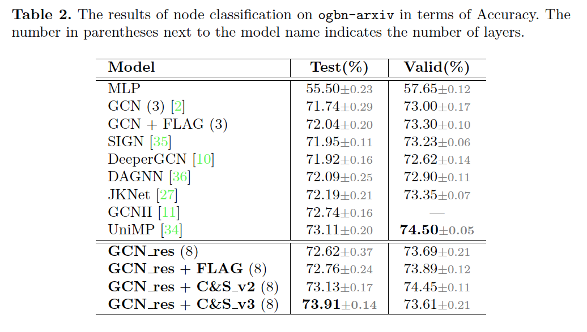
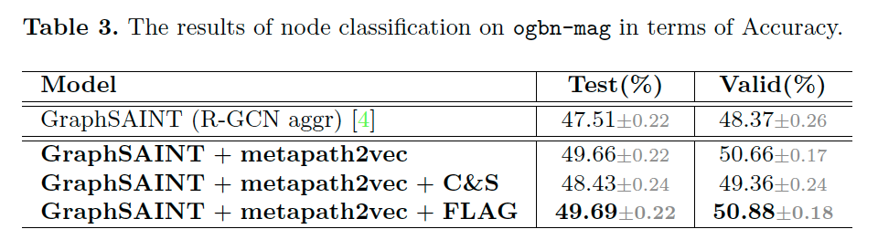
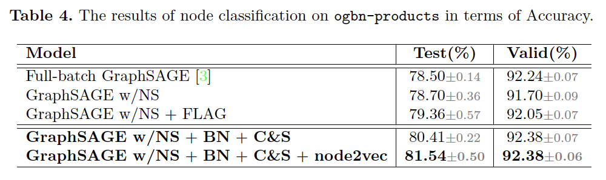
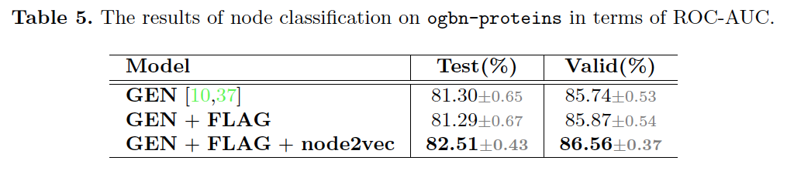

# Residual Network and Embedding Usage: New Tricks of Node Classification with Graph Convolutional Networks

Bags of Tricks in OGB (node classification) with GCNs.

In this work, we propose two novel tricks of GCNs for node classification tasks:  **GCN\_res Framework** and **Embedding Usage**, which can improve various GCNs significantly. Experiments on [Open Graph Benchmark](https://ogb.stanford.edu/)  (OGB) show that, by combining these techniques, the test accuracy of various GCNs increases by **1.21**%$\sim$**2.84**%. 

## *Overview*

Paper[].

#### `ogbn-arxiv`

+ **Code:** [**https://github.com/ytchx1999/PyG-ogbn-arxiv**](https://github.com/ytchx1999/PyG-ogbn-arxiv)
+ **Leaderboard**: [**https://ogb.stanford.edu/docs/leader_nodeprop/#ogbn-arxiv**](https://ogb.stanford.edu/docs/leader_nodeprop/#ogbn-arxiv)

#### `ogbn-mag`

+ **Code:** [**https://github.com/ytchx1999/PyG-ogbn-mag**](https://github.com/ytchx1999/PyG-ogbn-mag)
+ **Leaderboard**: [**https://ogb.stanford.edu/docs/leader_nodeprop/#ogbn-mag**](https://ogb.stanford.edu/docs/leader_nodeprop/#ogbn-mag)

#### `ogbn-products`

+ **Code:** [**https://github.com/ytchx1999/PyG-ogbn-products**](https://github.com/ytchx1999/PyG-ogbn-products)
+ **Leaderboard**: [**https://ogb.stanford.edu/docs/leader_nodeprop/#ogbn-products**](https://ogb.stanford.edu/docs/leader_nodeprop/#ogbn-products)

#### `ogbn-proteins`

+ **Code:** [**https://github.com/ytchx1999/PyG-ogbn-proteins**](https://github.com/ytchx1999/PyG-ogbn-proteins)
+ **Leaderboard**: [**https://ogb.stanford.edu/docs/leader_nodeprop/#ogbn-proteins**](https://ogb.stanford.edu/docs/leader_nodeprop/#ogbn-proteins)

## *Methods*

### GCN_res Framework


Overview of GCN_res Framework with a 4-layer toy example. The GCNs-Block consists of four parts: GCNsConv layer, Norm layer, activation function, and Dropout unit. Data stream of residual connections is indicated by arrows.

In this paper, we propose GCN res Framework by two main strategies in the forward propagation: (i) adaptive residual connections and initial residual connections; and (ii) softmax layer-aggregation.

### Embedding Usage


Embedding Usage for GCNs. We merge input featrues with embedding to generate new features for GCNs.

In this work, we take an initial step towards answering the questions above by proposing Embedding Usage to enhance node features.

## *Results on OGB Datasets*

###  Requirements

- PyTorch >= 1.6.0
- torch-geometric >= 1.6.0
- ogb >= 1.1.1

### `ogbn-arxiv`



### `ogbn-mag`



### `ogbn-products`



### `ogbn-proteins`



### t-SNE visualization on `ogbn-arxiv`


## *Cite*

Please cite our paper if you find anything helpful,

```

```

